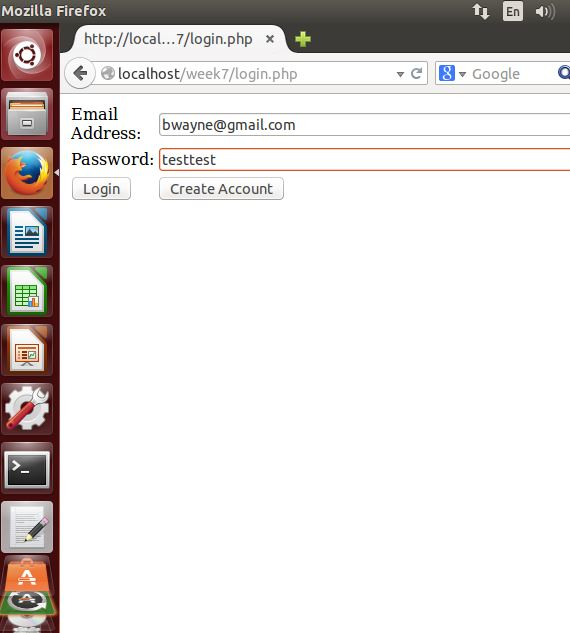
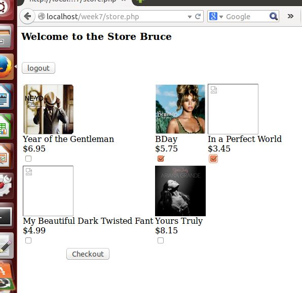
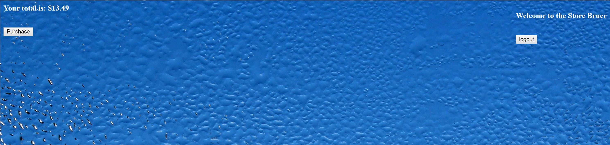

# Record Store

UPDATE 3/7/2018:

I have added a background image to the project as well as changed the font color. Other minor changes to the look and feel of the page have been made as well. Some of the changes are evident here in this updated look at the login page. Screenshots from the rest of the webpage are soon to come.

(To be updated)

This project is a webpage for a fictitious record store. I do not own any of the images used in this project, they are simply used for demonstrative purposes. 

The webpage connects to an SQL server running on the host server. The SQL db stores the credentials for all users of the store. This includes an admin account which can access the database in order to add, remove, and update product entries.

When first loading the webpage the user is greeted with the following screen:

Once the correct login details have been entered the user is taken to the store:

The user can then select which albums they would like to purchase and proceed to the checkout area:

The above is an example of the general use for a customer. If an admin logs into the store they are greeted with the following:

From here the admin can execute a variety of operations on the stores inventory.
